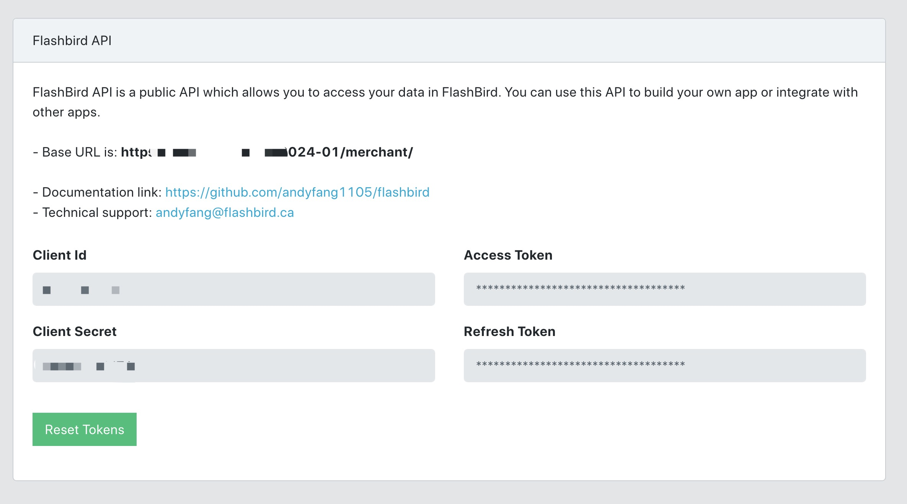

# Flashbird Merchant API Documentation

Welcome to the Flashbird API documentation. The Flashbird API allows you to programmatically access and manage shipments, providing a simple way to integrate Flashbird's services into your application.

## Table of Contents

- [Base URL](#base-url)
- [Authentication](#authentication)
  - [Obtain Access Token and Refresh Token from Flashbird Merchant Console](#obtain-access-token-and-refresh-token-from-flashbird-merchant-console)
  - [Obtain New Access Token via Refresh Token](#obtain-new-access-token-via-refresh-token)
- [Making Authenticated Requests](#making-authenticated-requests)
- [Endpoints](#endpoints)
  - [Create Shipment](#create-shipment)
  - [Update Shipment](#update-shipment)
  - [Delete Shipment](#delete-shipment)
  - [Get Tracking](#get-tracking)
  - [Create Label](#create-label)
  - [Create Pickup](#create-pickup)
  - [Delete Pickup](#delete-pickup)
  - [Get All Pickups](#get-all-pickups)
  - [Get Pickup](#get-pickup)


## Base URL

All URLs referenced in the documentation have the following base:

http://localhost:3001/api/2024-01/merchant

Please send an email to andyfang@flashbird.ca to request to enable Flashbird API for your account. After Flashbird API is enabled, please log in Flashbird website, navigate to API Authtoken, and replace above base URL with actual one.


## Authentication

To interact with the Flashbird API, you must first authenticate to receive an access token. Use this token in subsequent requests.

### Obtain Access Token and Refresh Token from Flashbird Merchant Console



To get your access token and refresh token directly from the Flashbird Merchant Console:

1. Log in to the Flashbird Merchant Console.
2. Ensure the Merchant API is enabled for your account.
3. Click the "Reset Token" button.
4. Enter your username and password in the popup dialog.
5. Your access token and refresh token will be displayed.

**Note:**
- The access token is valid for 1 hour. If it expires, you can use the refresh token to obtain a new access token.
- The refresh token is valid for 1 week and will be automatically renewed whenever you use it to obtain a new access token via the method described in the "Obtain New Access Token via Refresh Token" section.


### Obtain New Access Token via Refresh Token 

If your access token has expired and the API function returns a 401 status code, indicating unauthorized access due to an invalid or expired token, use the `refresh_token` obtained during the initial authentication to request a new access token.

**Endpoint:**
```
POST /authentication/token
```

**Headers:**
```
Content-Type: application/json
```

**Body:**
```json
{
  "client_id": "YOUR_CLIENT_ID",
  "client_secret": "YOUR_CLIENT_SECRET",
  "grant_type": "refresh_token",
  "refresh_token": "YOUR_REFRESH_TOKEN"
}
```

**Sample JavaScript Request:**
```javascript
const fetch = require('node-fetch');
const BASE_URL = 'http://localhost:3001/api/2024-01/merchant'; // Replace with actual base URL

const data = {
  client_id: 'mock_client_id',
  client_secret: 'mock_client_secret',
  grant_type: 'refresh_token',
  refresh_token: 'mock_refresh_token'
};

async function refreshAccessToken() {
  try {
    const response = await fetch(`${BASE_URL}/authentication/token`, {
      method: 'POST',
      headers: {
        'Content-Type': 'application/json'
      },
      body: JSON.stringify(data)
    });

    if (!response.ok) {
      throw new Error(`HTTP error! status: ${response.status}`);
    }

    const responseData = await response.json();
    console.log('New Access Token:', responseData.access_token);
    return responseData.access_token;
  } catch (error) {
    console.error('Fetching error:', error);
  }
}

refreshAccessToken();

```

**Response:**

A successful response will return a new `access_token`, the duration it's valid for (`expires_in`), and the type of token (`token_type`).

```json
{
  "access_token": "NEW_ACCESS_TOKEN",
  "expires_in": 3600,
  "token_type": "Bearer"
}
```


## Making Authenticated Requests
Once you have the access_token, include it in the Authorization header of your requests:

```
headers: {
  'Authorization': 'Bearer YOUR_ACCESS_TOKEN'
}
```

Endpoints
List the available endpoints, their methods, expected input, and output. For example:

## Create a Shipment
**Endpoint:**

```
POST /shipments
```

**Headers:**

```json
{
  "Content-Type": "application/json",
  "Authorization": "Bearer YOUR_ACCESS_TOKEN"
}
```
Replace `YOUR_ACCESS_TOKEN` with the actual access token obtained from the authentication process.


**Body:**

Provide the shipment details in the request body. The following fields are required: `name`, `phone`, `street`, `city_or_town`, `province`, `post_code`, `country` in both from and to sections. The `packaging` is an array where each item must include at least the weight. 

In the `packaging` array:

`length`, `width`, `height` should be specified in centimeters (cm).

`weight` should be specified in kilograms (kg).

```json
{
  "from": {
    "name": "Alice Smith",
    "phone": "(416) 555-0190",
    "street": "123 Yonge Street",
    "city_or_town": "Toronto",
    "province": "ON",
    "post_code": "M5B 1N8",
    "country": "Canada"
  },
  "to": {
    "name": "Bob Brown",
    "phone": "(416) 555-0132",
    "street": "456 Queen Street West",
    "city_or_town": "Toronto",
    "province": "ON",
    "post_code": "M5V 2B7",
    "country": "Canada"
  },
  "packaging": [
    {
      "length": 10,
      "width": 15,
      "height": 20,
      "weight": 5
    }
  ],
  "refno": "1234567"
  "notes": "Notes for delivery instructions",
  "items": "Description of the items",
}
```

**Sample JavaScript Request:**

```javascript
const fetch = require('node-fetch');
const BASE_URL = 'http://localhost:3001/api/2024-01/merchant'; // Replace with actual base URL
const endpoint = 'shipments'; // The endpoint for creating shipments
const accessToken = 'YOUR_ACCESS_TOKEN'; // Replace with your actual access token

const shipmentData = {
  "from": {
    "name": "Alice Smith",
    "phone": "(416) 555-0190",
    "street": "123 Yonge Street",
    "city_or_town": "Toronto",
    "province": "ON",
    "post_code": "M5B 1N8",
    "country": "Canada"
  },
  "to": {
    "name": "Bob Brown",
    "phone": "(416) 555-0132",
    "street": "456 Queen Street West",
    "city_or_town": "Toronto",
    "province": "ON",
    "post_code": "M5V 2B7",
    "country": "Canada"
  },
  "packaging": [
    {
      "length": 10,
      "width": 15,
      "height": 20,
      "weight": 5
    }
  ],
  "refno": "1234567"
  "notes": "Notes for delivery instructions",
  "items": "Description of the items",
};

async function createShipment() {
  try {
    const response = await fetch(`${BASE_URL}/${endpoint}`, {
      method: 'POST',
      headers: {
        'Content-Type': 'application/json',
        'Authorization': `Bearer ${accessToken}`
      },
      body: JSON.stringify(shipmentData),
    });

    if (!response.ok) {
      throw new Error(`HTTP error! status: ${response.status}`);
    }

    const responseData = await response.json();
    console.log('Response Data:', responseData);
  } catch (error) {
    console.error('Fetching error:', error);
  }
}

createShipment();
```

**Response:**

The response will provide details about the success or failure of the shipment creation.

- **When Successful (rc is 0):**
  ```json
  {
    "rc": 0,
    "number": "UNIQUE_SHIPMENT_NUMBER",
    "refno": "YOUR_REFERENCE_NUMBER",
    "message": "Successfully created a shipment",
    "timestamp": 1704152543232
  }
  
  ```
- **When Failed (rc is -1):**

  Duplicate Reference Number Example:

  ```json
  {
    "rc": -1,
    "refno": "YOUR_REFERENCE_NUMBER",
    "number": "",
    "message": "Failed to create the shipment due to duplicate Ref No. (YOUR_REFERENCE_NUMBER) found in shipment UNIQUE_SHIPMENT_NUMBER",
    "timestamp": 1704152662478
  }
  
  ```

  Out of Service Area Example:

  ```json
  {
    "rc": -1,
    "refno": "YOUR_REFERENCE_NUMBER",
    "number": "",
    "message": "FSA/Postal Code A8S is out of service area",
    "timestamp": 1704152679730
  }
  ```


## Update Shipment
**Endpoint:**

```
PUT /shipments/{shipmentNumber}
```

**Headers:**

```json
{
  "Content-Type": "application/json",
  "Authorization": "Bearer YOUR_ACCESS_TOKEN"
}
```
Replace `YOUR_ACCESS_TOKEN` with the actual access token obtained from the authentication process.


**URL Parameters:**

shipmentNumber: The unique tracking number of the shipment to be updated.

**Body:**
Provide the updated shipment details in the request body. The same fields as in the shipment creation are applicable, but only the fields that are being updated need to be included.

```json
{
  "from": {
    "name": "Alice Smith",
    "phone": "(416) 555-0190",
    "street": "123 Yonge Street",
    "city_or_town": "Toronto",
    "province": "ON",
    "post_code": "M5B 1N8",
    "country": "Canada"
  },
  "to": {
    "name": "Bob Brown",
    "phone": "(416) 555-0132",
    "street": "456 Queen Street West",
    "city_or_town": "Toronto",
    "province": "ON",
    "post_code": "M5V 2B7",
    "country": "Canada"
  },
  "packaging": [
    {
      "length": "10",
      "width": "15",
      "height": "20",
      "weight": 5
    }
  ],
  "refno": "1234567"
}
```

**Sample JavaScript Request:**
```javascript
const fetch = require('node-fetch');
const BASE_URL = 'http://localhost:3001/api/2024-01/merchant'; // Replace with actual base URL
const accessToken = 'YOUR_ACCESS_TOKEN'; // Replace with your actual access token
const shipmentNumber = '774017844640'; // Replace with the actual shipment number to be updated

const updatedShipmentData = {
  // Include updated shipment data here
};

async function updateShipment() {
  try {
    const response = await fetch(`${BASE_URL}/shipments/${shipmentNumber}`, {
      method: 'PUT',
      headers: {
        'Content-Type': 'application/json',
        'Authorization': `Bearer ${accessToken}`
      },
      body: JSON.stringify(updatedShipmentData),
    });

    if (!response.ok) {
      const errorResponse = await response.json();
      throw new Error(`HTTP error! status: ${response.status}, message: ${errorResponse.errors[0].message}`);
    }

    const responseData = await response.json();
    console.log('Response Data:', responseData);
  } catch (error) {
    console.error('Fetching error:', error);
  }
}

updateShipment();
```
**Response:**


- **When Successful (response.ok and rc is 0):**
```json
{
  "rc": 0,
  "number": "UPDATED_SHIPMENT_NUMBER",
  "msg": "Shipment updated",
}
```
- **When Failed (response.ok is not true):**
  Check ${response.status} and ${errorResponse.errors[0].message}


## Delete Shipment
**Endpoint:**

```
DELETE /shipments/{shipmentNumber}
```

**Headers:**

```json
{
  "Content-Type": "application/json",
  "Authorization": "Bearer YOUR_ACCESS_TOKEN"
}
```
Replace `YOUR_ACCESS_TOKEN` with the actual access token obtained from the authentication process.

**URL Parameters:**
shipmentNumber: The unique identifier of the shipment to be deleted.

**Sample JavaScript Request:**
```javascript
const fetch = require('node-fetch');
const BASE_URL = 'http://localhost:3001/api/2024-01/merchant'; // Replace with actual base URL
const accessToken = 'YOUR_ACCESS_TOKEN'; // Replace with your actual access token
const shipmentNumber = '774012744635'; // Replace with the actual shipment number to be deleted

async function deleteShipment() {
  try {
    const response = await fetch(`${BASE_URL}/shipments/${shipmentNumber}`, {
      method: 'DELETE',
      headers: {
        'Content-Type': 'application/json',
        'Authorization': `Bearer ${accessToken}`
      },
    });

    if (!response.ok) {
      const errorResponse = await response.json();
      throw new Error(`HTTP error! status: ${response.status}, message: ${errorResponse.errors[0].message}`);
    }
    console.log('Shipment deleted successfully');
  } catch (error) {
    console.error('Fetching error:', error);
  }
}

deleteShipment();
```

**Response:**

The response will confirm the success or failure of the deletion request.

-**When Successful:**
The request will complete without errors, and the response body will typically be empty.

-**When Failed:**
If the shipment cannot be deleted (e.g., due to invalid shipment number, lack of permissions, or other issues), the response will include details about the failure in ${response.status} and ${errorResponse.errors[0].message}


## Get Tracking
**Endpoint:**
```
GET /trackings/{shipmentNumber}
```

**Headers:**
```json
{
  "Content-Type": "application/json",
  "Authorization": "Bearer YOUR_ACCESS_TOKEN"
}
```
Replace YOUR_ACCESS_TOKEN with the actual access token obtained from the authentication process.

**URL Parameters:**
shipmentNumber: The unique identifier of the shipment for which tracking information is being requested.

**Sample JavaScript Request:**
```javascript
const fetch = require('node-fetch');
const BASE_URL = 'http://localhost:3001/api/2024-01/merchant'; // Replace with actual base URL
const accessToken = 'YOUR_ACCESS_TOKEN'; // Replace with your actual access token
const shipmentNumber = '774013244625'; // Replace with the actual shipment number to get tracking info

async function getTracking() {
    try {
        const response = await fetch(`${BASE_URL}/trackings/${shipmentNumber}`, {
            method: 'GET',
            headers: {
                'Content-Type': 'application/json',
                'Authorization': `Bearer ${accessToken}`,
            }
        });

        if (!response.ok) {
            const errorResponse = await response.json();
            throw new Error(`HTTP error! status: ${response.status}, message: ${errorResponse.errors[0].message}`);
        }

        const responseData = await response.json();
        console.log('Response Data:', responseData);
    } catch (error) {
        console.error('Fetching error:', error);
    }
}

getTracking();
```

**Response:**
The response will provide detailed tracking information about the shipment.


-**When Successful:**
```json
{
  "number": "774013244625",
  "isDelivered": 1,
  "images": [
    {
      "type": "delivered",
      "url": "https://flashbird.s3.us-west-2.amazonaws.com/driver/cd926d9b-635a-4977-93cb-ff5783264fc01705867432397-65a77d7532c2d0051d0a4ba6.jpeg"
    },
    {
      "type": "signature",
      "url": "https://flashbird.s3.us-west-2.amazonaws.com/driver/96f824b3-4eae-4e9d-8ed9-4951ac1db8011705867440867-65a77d7532c2d0051d0a4ba6.jpeg"
    }
  ],
  "logs": [
    { "message": "Shipment created", "time": 1704152668668 },
    { "message": "Picked up by FlashBird", "time": 1704153477466 },
    { "message": "Out for delivery", "time": 1705475445880 },
    { "message": "Parcel delivered", "time": 1705867447106 }
  ]
}
```

-**When Failed:**
If the tracking information cannot be retrieved (e.g., due to invalid shipment number, lack of permissions, or other issues), the response will include details about the failure.


## Create Label

**Endpoint:**
```
POST /labels
```

**Headers:**
```json
{
  "Content-Type": "application/json",
  "Authorization": "Bearer YOUR_ACCESS_TOKEN"
}
```
Replace YOUR_ACCESS_TOKEN with the actual access token obtained from the authentication process.

**Body:**
Send an array of shipment numbers for which you need to create labels.

```json
{
  "numbers": ["774013244625"]
}
```
Replace the array elements with the actual shipment numbers.


**Sample JavaScript Request:**
```javascript
const fetch = require('node-fetch');
const BASE_URL = 'http://localhost:3001/api/2024-01/merchant'; // Replace with actual base URL
const accessToken = 'YOUR_ACCESS_TOKEN'; // Replace with your actual access token
const endpoint = 'labels'; // The endpoint for creating labels
const shipmentNumbers = ['774013244625']; // Replace with actual shipment numbers

async function createLabels() {
    try {
        const response = await fetch(`${BASE_URL}/${endpoint}`, {
            method: 'POST',
            headers: {
                'Content-Type': 'application/json',
                'Authorization': `Bearer ${accessToken}`,
            },
            body: JSON.stringify({ numbers: shipmentNumbers }),
        });

        if (!response.ok) {
            const errorResponse = await response.json();
            throw new Error(`HTTP error! status: ${response.status}, message: ${errorResponse.errors[0].message}`);
        }

        const responseData = await response.json();
        console.log('Response Data:', responseData);
    } catch (error) {
        console.error('Fetching error:', error);
    }
}

createLabels();
```

**Response:**
Upon successful creation, the response will include the labels for the specified shipments.

-**When Successful:**
The response will include the label data in base64 format.

```json
{
  "labels": [
    {
      "number": "774013244625",
      "label": "JVBERi0xLjMKJf////8KOSAwIG9iago8PAovVHlwZSAvRXh0..."
    }
  ]
}
```

-**When Failed:**
If the labels cannot be created (e.g., due to invalid shipment numbers, lack of permissions, or other issues), the response will include details about the failure.


## Create Pickup

**Endpoint:**
```
POST /pickups
```

**Headers:**
```json
{
  "Content-Type": "application/json",
  "Authorization": "Bearer YOUR_ACCESS_TOKEN"
}
```
Replace YOUR_ACCESS_TOKEN with the actual access token obtained from the authentication process.


**Body:**
Include the details of the contact for pickup in the request body.

```json
{
  "contact": {
    "name": "John Doe",
    "company": "ABC Company",
    "phone": "1234567890",
    "email": "johndoe@example.com",
    "street": "123 Main Street",
    "city_or_town": "Toronto",
    "province": "ON",
    "country": "Canada",
    "post_code": "M5V 2B7"
  }
}
```
Replace the details with the actual information for the contact.

**Sample JavaScript Request:**
```javascript
const fetch = require('node-fetch');
const BASE_URL = 'http://localhost:3001/api/2024-01/merchant'; // Replace with actual base URL
const accessToken = 'YOUR_ACCESS_TOKEN'; // Replace with your actual access token
const endpoint = 'pickups'; // The endpoint for creating pickups
const pickupData = {
  "contact": {
    "name": "John Doe",
    "company": "ABC Company",
    "phone": "1234567890",
    "email": "johndoe@example.com",
    "street": "123 Main Street",
    "city_or_town": "Toronto",
    "province": "ON",
    "country": "Canada",
    "post_code": "M5V 2B7"
  }
};

async function createPickup() {
    try {
        const response = await fetch(`${BASE_URL}/${endpoint}`, {
            method: 'POST',
            headers: {
                'Content-Type': 'application/json',
                'Authorization': `Bearer ${accessToken}`,
            },
            body: JSON.stringify(pickupData),
        });

        if (!response.ok) {
            const errorResponse = await response.json();
            throw new Error(`HTTP error! status: ${response.status}, message: ${errorResponse.errors[0].message}`);
        }

        const responseData = await response.json();
        console.log('Response Data:', responseData);
    } catch (error) {
        console.error('Fetching error:', error);
    }
}

createPickup();
```

**Response:**
Upon successful creation, the response will confirm the pickup request and provide details about the scheduled pickup.

-**When Successful:**
The response will include details such as the pickup number and the scheduled date and time.

```json
{
  "id": "PICKUP_ID",
  "scheduledDate": "2024-01-25",
  "msg": "Success",
}
```

-**When Failed:**
If the pickup cannot be created (e.g., due to invalid contact information, lack of permissions, or other issues), the response will include details about the failure.


## Delete Pickup

**Endpoint:**
```
DELETE /pickups/{id}
```
Replace {id} with the actual ID of the pickup you want to delete.

**Headers:**
{
  "Content-Type": "application/json",
  "Authorization": "Bearer YOUR_ACCESS_TOKEN"
}

Replace YOUR_ACCESS_TOKEN with the actual access token obtained from the authentication process.

**JavaScript Function to Delete a Pickup:**
```javascript
const fetch = require('node-fetch');
const BASE_URL = 'http://localhost:3001/api/2024-01/merchant'; // Replace with actual base URL
const accessToken = 'YOUR_ACCESS_TOKEN'; // Replace with your actual access token
const endpoint = 'pickups'; // The endpoint for deleting pickups

async function deletePickup(endpoint, id, accessToken) {
    try {
        const response = await fetch(`${BASE_URL}/${endpoint}/${id}`, {
            method: 'DELETE',
            headers: {
                'Content-Type': 'application/json',
                'Authorization': `Bearer ${accessToken}`,
            }
        });

        if (!response.ok) {
            const errorResponse = await response.json();
            throw new Error(`HTTP error! status: ${response.status}, message: ${errorResponse.errors[0].message}`);
        }
        console.log('Response Status:', response.status);
    } catch (error) {
        console.error('Fetching error:', error);
    }
}

// Example usage:
deletePickup(endpoint, 'PICKUP_ID', accessToken).then(() => console.log('API call completed.'));
```
**Response:**

The response will indicate the status of the pickup deletion request.

-**Successful Deletion:**
The server will respond with a 204 No Content status, indicating that the pickup was successfully deleted.

-**Failed Deletion:**
If the pickup ID is not found, invalid or other failures, check ${response.status} and ${errorResponse.errors[0].message} for more details.


## Get All Pickups

**Endpoint:**
```
GET /pickups
```

**Headers:**
```json
{
  "Content-Type": "application/json",
  "Authorization": "Bearer YOUR_ACCESS_TOKEN"
}
```
Replace YOUR_ACCESS_TOKEN with the actual access token obtained from the authentication process.

**JavaScript Function to Get All Pickups:**
```javascript
const fetch = require('node-fetch');
const BASE_URL = 'http://localhost:3001/api/2024-01/merchant'; // Replace with actual base URL
const accessToken = 'YOUR_ACCESS_TOKEN'; // Replace with your actual access token
const endpoint = 'pickups'; // The endpoint for retrieving all pickups

async function getAllPickups(endpoint, accessToken) {
    try {
        const response = await fetch(`${BASE_URL}/${endpoint}`, {
            method: 'GET',
            headers: {
                'Content-Type': 'application/json',
                'Authorization': `Bearer ${accessToken}`,
            }
        });

        if (!response.ok) {
            const errorResponse = await response.json();
            throw new Error(`HTTP error! status: ${response.status}, message: ${errorResponse.errors[0].message}`);
        }

        const responseData = await response.json();
        console.log('Response Data:', responseData);
    } catch (error) {
        console.error('Fetching error:', error);
    }
}

// Example usage:
getAllPickups(endpoint, accessToken).then(() => console.log('API call completed.'));
```

**Response:**

The response will include a list of all pickups available in your account.

```json
{
  "pickups": [
    {
      "id": "pickup_id_1",
      "status": "open",
      "contact": {
        "name": "John Doe",
        "company": "ABC Company",
        "phone": "1234567890",
        "email": "johndoe@example.com",
        "street": "123 Main Street",
        "city_or_town": "Toronto",
        "province": "ON",
        "country": "Canada",
        "post_code": "M5V 2B7"
      },
      "created_at": 1704152668668
    },
    // More pickups...
  ]
}
```
The response will include details such as pickup ID, contact information, and created_at for each pickup.

## Get Pickup

**Endpoint:**
```
GET /pickups/{pickup_id}
```
Replace {pickup_id} with the actual ID of the pickup you want to retrieve.

**Headers:**
```json
{
  "Content-Type": "application/json",
  "Authorization": "Bearer YOUR_ACCESS_TOKEN"
}
```

Replace YOUR_ACCESS_TOKEN with the actual access token obtained from the authentication process.

**JavaScript Function to Get a Pickup:**
```javascript
const fetch = require('node-fetch');
const BASE_URL = 'http://localhost:3001/api/2024-01/merchant'; // Replace with actual base URL
const endpoint = 'pickups'; // The endpoint for retrieving a specific pickup
const accessToken = 'YOUR_ACCESS_TOKEN'; // Replace with your actual access token

async function getPickup(endpoint, id, accessToken) {
    try {
        const response = await fetch(`${BASE_URL}/${endpoint}/${id}`, {
            method: 'GET',
            headers: {
                'Content-Type': 'application/json',
                'Authorization': `Bearer ${accessToken}`,
            }
        });

        if (!response.ok) {
            const errorResponse = await response.json();
            throw new Error(`HTTP error! status: ${response.status}, message: ${errorResponse.errors[0].message}`);
        }

        const responseData = await response.json();
        console.log('Response Data:', responseData);
    } catch (error) {
        console.error('Fetching error:', error);
    }
}

// Example usage:
// For existing pickup
getPickup(endpoint, '65a9efa6cb6eaae46ae6d1d9', accessToken).then(() => console.log('API call completed.'));

// For non-existing pickup
getPickup(endpoint, '65a9efa6cb6eaae46ae6d1d7', accessToken).then(() => console.log('API call completed.'));
```

**Response:**
-**When Successful:**
```json
{
  "status": "open",
  "contact": {
    "name": "Andy",
    "company": "ABC Company",
    "phone": "1234567890",
    "email": "andy@example.com",
    "street": "123 Main Street",
    "city_or_town": "Etobicoke",
    "province": "ON",
    "country": "Canada",
    "post_code": "M4S2T8"
  },
  "created_at": 1705635749992,
  "id": "65a9efa6cb6eaae46ae6d1d9"
}
```
-**When Failed**
Check ${response.status} and ${errorResponse.errors[0].message} for more details


